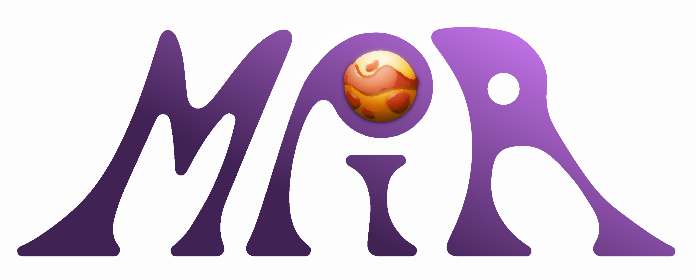
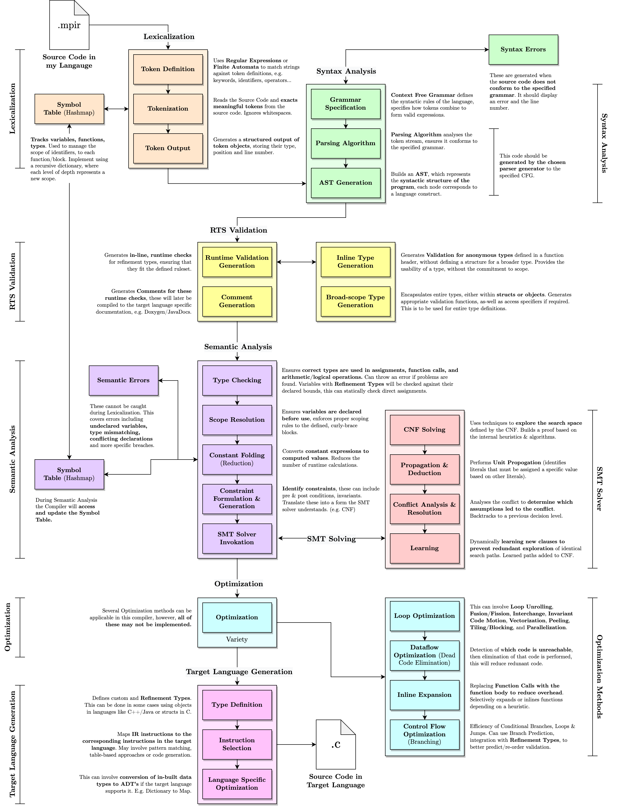

MPIR is a programming language, with a focus on a **refinement-type** system, allowing users to outsource lengthy computation into formally defined type constraints.

MPIR, akin to many other languages, aims to provide an **easy-to-use, syntactically futureproofed** interface to machine code. What differentiates MPIR from other languages, however, is its focus on a **Refinement Type System**, which allows users to **formally define constraints on types** through **propositional** and **predicate** logic, which in combination with **tag-associated documentation**, will allow programmers to create **well documented**, **readable** code that is **understandable in the long-term**.

