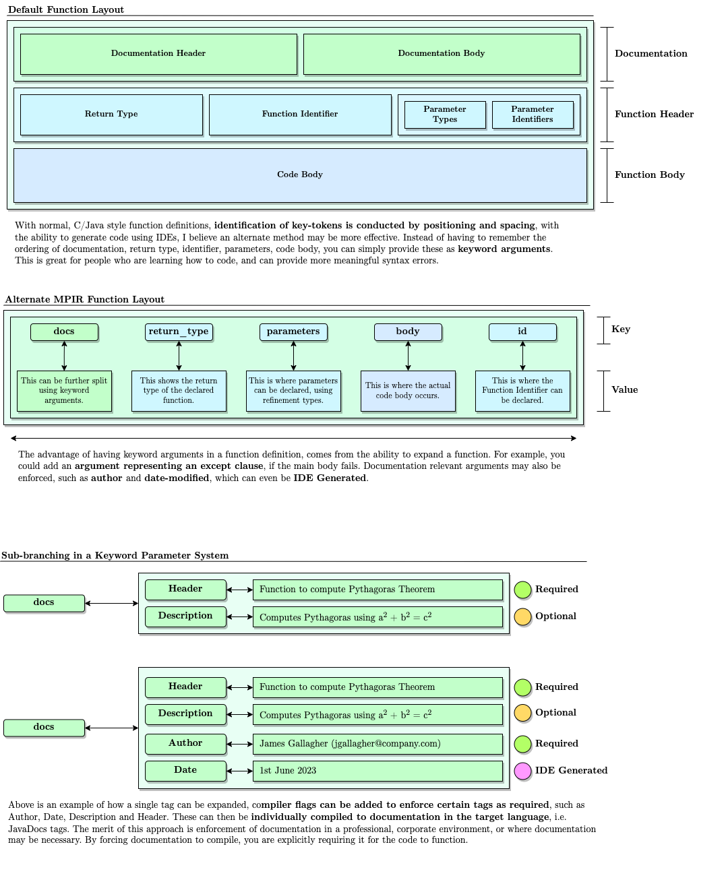

### MPIR: Metalanguage with Refinement Types and SMT-based Static Checking

MPIR (Meta Programming Intermediate Representation) is an **advanced metalanguage** designed to empower developers with the combined advantages of interpreted runtimes and compiled languages. With its unique features, including a refinement type system and `Satisfiability Modulo Theories (SMT)-based static checking`, MPIR facilitates the **creation of robust and high-performance software**. By abstracting away the language-specific details, MPIR enables programmers to **focus on the logic of their programs without being bound to a specific programming language.**

#### Features
MPIR, akin to many other languages, aims to provide an easy-to-use, syntactically futureproofed interface to machine code. What differentiates MPIR from other languages, however, is its focus on a Refinement Type System, which allows users to formally define constraints on types through propositional and predicate logic (explained in 2.1), which in combination with tag-associated documentation (1.1) will allow programmers to create well documented, readable code that is understandable in the long-term.
#### Refinement Type System
MPIR incorporates a refinement type system that enhances the expressiveness and safety of the language. Refinement types provide stronger guarantees about the values that variables can hold, enabling more precise static analysis and catching errors at compile-time.
 

#### SMT-based Static Checking
MPIR leverages Satisfiability Modulo Theories (SMT) solving techniques to perform static analysis on code during compilation. This approach enables the compiler to validate program correctness, verify type safety, and ensure adherence to specified refinements, all before the code is executed.
 

#### Interpreted Runtime
MPIR allows developers to quickly compile to Python, allowing for fast testing of their codebase. Work with the agility and development speed of an interpreted environment, with the speed-benefits and optimization of LLVM Compiled Languages such as C/C++.
 

#### Performance & Agility
Compilation to C and C++: MPIR supports the compilation of code to efficient C and C++ code, allowing developers to harness the performance benefits of compiled languages. The resulting executable code can be deployed as standalone applications or integrated into existing projects.
 

#### Compiler Overview 
Here is an overview of how the Transpiler will process the given .mpir file into a encoded file in the target language. I intend to use Microsoft Z3 integration for static SMT analysis. 

#### Language Syntax
Here is an overview of the syntax of MPIR, compared against the structural syntax of current high-level languages, with advantages shown regarding workplace and educational integrations. 
